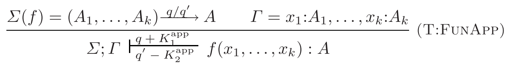
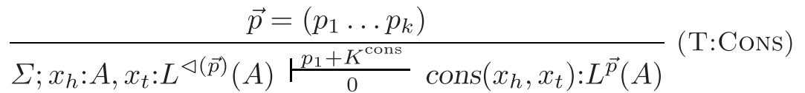
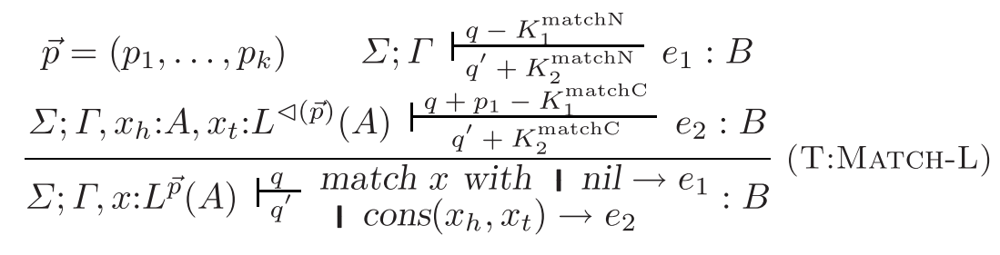
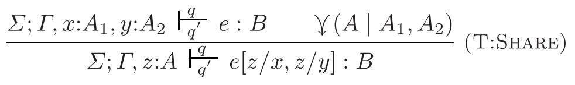
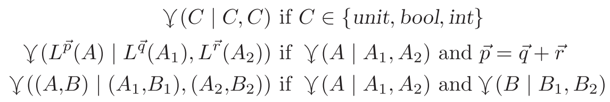
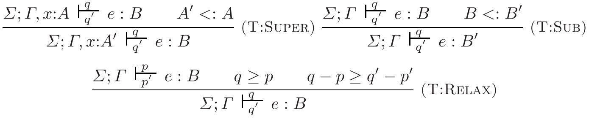
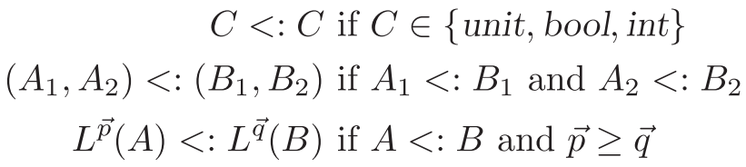

# リソース計算

## 2021/07/05 藤浪大弥

---

# リソース計算の概要

- リソース計算とは
- 重要性
- 実現方法
- 参考文献
- Resource Aware ML (RaML)

---

## リソース計算とは

- 与えられたプログラムが使用するリソースの量を **静的** に見積もる手法。
- リソースは利用者が自由に定義できる。
  * ヒープメモリ使用量 (空間計算量)、
  * 実行ステップ数 (時間計算量)、
  * などなど。

例: 次の OCaml プログラムから、

```ocaml
let rec append l1 l2 =
  match l1 with
  | []      -> l2
  | x :: xs -> x :: append xs l2
```

メモリ使用量を表す関数: $f(m, n) = m$ を求めたい。\
($m$ は第1引数のリストの長さ、$n$ は第2引数のリストの長さ)

---

## 重要性

- 元々、組み込みの現場などでプログラムのメモリ使用量や実行時間を厳密に見積もりたい、\
  という需要があった。
- 実際に実行してから「足りない」となっては遅い。
- →事前に、静的に見積もりたい。

<br>

- さらに **近年では**、実行時間や使用リソースの量に比例した金銭を支払うような仕組みが広がっている。
  * Ethereum などの DApp (分散型アプリケーション)、スマート・コントラクトプラットフォーム
  * AWS などのクラウドコンピューティングサービス
- こうしたサービスの利用ではリソース使用料が事前に見積もれれば、\
  適切な予算の確保が可能となる。

まさに、

<center>「<strong>時は金なり</strong>」</center>

---

## 実現方法

- リソースについての情報を含むようなプログラムの意味論を定める。
- 意味論に基づいて、リソースに関わる情報を変数とする制約式・漸化式をプログラムから導出する。
- 制約式・漸化式を求める方法、
  * **アノテーション付きの型から制約式** \[Hofmann, M., & Jost, S. (2003)\]
  * ホーン節から漸化式 \[V. Pérez, M. Klemen, P. López-García et. al. (2020)\]
- 求めた制約式・漸化式を LP ソルバー や CAS で解いて、解からリソース使用量を得る。

---
class: 'text-sm'
---

## 参考文献

- **Hofmann, M.**, & Jost, S. (2003). Static prediction of heap space usage for first-order functional programs.\
  ACM SIGPLAN Notices, 38(1), 185–197.
- **Hoffmann, J.**, & **Hofmann, M.** (2010). Amortized Resource Analysis with Polynomial Potential (pp. 287–306).\
  Springer, Berlin, Heidelberg.
- **Hoffmann, J.**, Aehlig, K., & **Hofmann, M.** (2012). Multivariate amortized resource analysis.\
  ACM Transactions on Programming Languages and Systems, 34(3).
- Kahn, D. M., & **Hoffmann, J.** (2020). Exponential Automatic Amortized Resource Analysis.\
  Lecture Notes in Computer Science, 12077 LNCS, 359–380.

<br>

- Nielson, F., Nielson, H. R., & Seidl, H. (2002). Automatic complexity analysis.\
  Lecture Notes in Computer Science, 2305, 243–261.
- Navas, J., Mera, E., López-García, P., & Hermenegildo, M. V. (2007). User-definable resource bounds analysis for logic programs.\
  Lecture Notes in Computer Science, 4670 LNCS, 348–363.
- Navas, J., Méndez-Lojo, M., & Hermenegildo, M. V. (2009). User-Definable Resource Usage Bounds Analysis for Java Bytecode.\
  Electronic Notes in Theoretical Computer Science, 253, 65–82.
- Pérez, V., Klemen, M., López-García, P., Morales, J. F., & Hermenegildo, M. (2020).\
Cost Analysis of Smart Contracts via Parametric Resource Analysis.

---

## Resource Aware ML (RaML)

> Resource Aware ML (RaML) is a tool that automatically and statically computes resource-use bounds for OCaml programs.

<https://raml.co>

- Hoffmann J. らが中心となって開発している、OCaml のリソース使用量を静的に推定できるプログラム
- オープンソース。ライセンスは BSD-2 (開発はクローズド)。
- 次のようなプログラムに対応している。
  * ユーザー定義のデータ型
  * 高階関数
  * 確率的なプログラム
- 多項式・多変数のリソース使用量を推定できる。
- 前述の「アノテーション付きの型から制約式を求める手法」が実装されている。

---

# アノテーション付きの型から制約式を得る

- プログラムと型
- 償却解析
- アノテーション付きの型
- 型付け規則
- 型推論
- さまざまな拡張

"Amortized Resource Analysis with Polynomial Potential" (2010) をベースに説明する。

---

## プログラムと型

1階の関数型言語を対象とする。

式:

$$
\begin{align*}
e ::=&\ ()\ |\ \mathrm{true}\ |\ \mathrm{false}\ |\ x \\
    |&\ f\ x \cdots x\ |\ \mathrm{let}\ x = e\ \mathrm{in}\ e \\
    |&\ \mathrm{if}\ x\ \mathrm{then}\ e\ \mathrm{else}\ e \\
    |&\ (x, x)\ |\ \mathrm{match}\ x\ \mathrm{with}\ (x, x) \to e \\
    |&\ \mathrm{nil}\ |\ \textcolor{red}{\mathrm{cons}(x, x)} \\
    |&\ \textcolor{red}{\mathrm{match}\ x\ \mathrm{with}\ \mathrm{nil} \to e\ \mathbf{|} \ \mathrm{cons}(x, x) \to e} \\
\end{align*}
$$

型:

$$
\begin{align*}
A ::=&\ \mathrm{unit}\ |\ \mathrm{bool}\ |\ L(A)\ |\ (A, A) \\
F ::=&\ (A, \cdots, A) \to A
\end{align*}
$$

---

## 償却解析

- 計算量の解析に用いられる手法の1つで、一連の処理の計算量 (リソース量) を分析するもの。
- その中でも、物理学者法 (physicist's method) と呼ばれる手法に基づいている。
- 処理の前後の状態にポテンシャル $q_\mathrm{before}, q_\mathrm{after}$と呼ばれる非負の実数を割り当て、\
  実際の計算量は $q_\mathrm{before} - q_\mathrm{after}$ となるようにする (計算量なので $q_\mathrm{before} - q_\mathrm{after} > 0$ となる)。

<br>

- ポテンシャルはその時点での残りのリソース量を表している。
- 処理の前と後の計算量 (リソース量) を考えることで、柔軟に解析できる。
  * 例えば「処理中にメモリを $4$ セル確保する必要があるが、うち $3$ セルは処理中に解放される」場合、\
    事前のポテンシャルは $4$ で事後のポテンシャルは $3$ となる。

---

## アノテーション付きの型

リスト型 (再帰的な型) の処理にかかるリソースの量を表すアノテーションを付ける。

$$
\begin{align*}
A ::=&\ \mathrm{unit}\ |\ \mathrm{bool}\ |\ L^{\overrightarrow{p}}(A)\ |\ (A, A) \\
F ::=&\ (A, \cdots, A) \xrightarrow{q/q'} A
\end{align*}
$$

$q, q'$ はポテンシャル。つまり $q$ は適用に必要なリソース量、$q'$ は適用後のリソース量

$\overrightarrow{p} = (p_1, \cdots, p_k)$ はリソースアノテーション。各 $p_i$ ($1 \le i \le k$) は非負の有理数とする。

これは二項係数の多項式の係数となる。

例えば、型 $(L^{(1, 2)}(\mathrm{bool})) \xrightarrow{0/0} L^{(0, 0)}(\mathrm{bool})$ 関数の計算量は、$n$ を第1引数の長さとして、

$$
1 \times \binom{n}{1} + 2 \times \binom{n}{2} = 1 \times n + 2 \times \frac{n (n - 1)}{2} = n^2
$$


---

## 型付け規則

関数適用:



- $\Sigma$: 関数の環境、$\Gamma$: 変数の環境
- $K^{\mathrm{app}}_1, K^{\mathrm{app}}_2$ はリソースの種類によって定義される定数
- ヒープメモリの使用量の解析の場合はどちらも $0$ だが、\
  例えば実行ステップの解析であれば適切な値が設定される。

---
class: 'text-sm'
---

## 型付け規則

$$
\lhd(\overrightarrow{p}) = (p_1 + p_2, \cdots, p_{k-1} + p_k, p_k)
$$





---

## 型付け規則

2回出てくる変数は2つの変数に分けて考える (share 規則)。





---

## 型付け規則

事前に必要なリソース量はより多く、事後のリソース量はより少なく取ってもよい。(relax 規則・部分型付け)

<center>





</center>

---

## 型推論

事前に必要なリソース量と事後のリソース量、型のリソースアノテーション $\overrightarrow{p}$ の各値を変数として\
型推論を行い、適用した型付け規則に応じて制約式を集めていく。\
(リソースアノテーションの大きさ $k$、つまりリソースの計算量の最大次数は予め決めておく)

集める制約式は線形の式になるので、\
線形計画 (LP) ソルバーで効率的に解を求めることができる。

ただし、$k$ が小さすぎた場合制約式が足りず LP ソルバーが解を求めることに失敗するので、\
その場合は $k$ を増やして再度実行する必要がある。

例: 次の関数 `append : bool -> bool` のメモリ使用量を求める。

```ocaml
let rec append l1 l2 =
  match l1 with
  | nil         -> l2
  | cons(x, xs) ->
    let l3 = append xs l2
    in cons(x, l3)
```

---
class: 'text-sm'
---

## 型推論

```ocaml
let rec append l1 l2 =    (* 1. *)
  match l1 with           (* 2. *)
  | nil         -> l2
  | cons(x, xs) ->
    let l3 = append xs l2 (* 3. *)
    in cons(x, l3)        (* 4. *)
```

$k = 2$ とする。また $K^\mathrm{cons} = 1$ でその他の $K$ は $0$。\
得られた式は relax 規則・部分型付けが適用されて不等式になっていることに注意。

1. `append` の型を $(L^{(p_1, p_2)}(\mathrm{bool}), L^{(p_3, p_4)}(\mathrm{bool})) \xrightarrow{q_1/q_2} L^{(p_5, p_6)}(\mathrm{bool})$ とおく。また $q_1 \ge q_2$。
2. `xs` の型を $L^{(p_7, p_8)}(\mathrm{bool})$ とおくと、リストに対する $\mathrm{match}$ の型付け規則から $p_1 + p_2 \ge p_7, p_2 \ge p_8$ という制約式が得られる。\
   また 3. 以降の式の事前リソースの量を $q_3$ として $q_1 + p_1 \ge q_3$。
3. `append` を再帰的に呼び出しているので $p_7 \ge p_1, p_8 \ge p_2, q_3 \ge q_1$、`l3` の型を $L^{(p_9,p_{10})}(\mathrm{bool})$ として $p_5 \ge p_9, p_6 \ge p_{10}$。\
  さらに 4. の事前リソースの量を $q_4$ として $q_3 - (q_1 - q_2) \ge q_4$。
4. `cons` のメモリ確保の分で $q_4 \ge q_2 + p_5 + K^\mathrm{cons} = q_2 + p_5 + 1$。
   さらにこの値は戻り値なので $p_9 \ge p_5 + p_6, p_{10} \ge p_6$。

---

## 型推論

最終的に求まる制約式は次のようになる。

- $p_i, q_j \ge 0$ ($1 \le i \le 10, 1 \le j \le 4$)
- $q_1 \ge q_2$
- $p_1 + p_2 \ge p_7, p_2 \ge p_8$
- $q_1 + p_1 \ge q_3$
- $p_7 \ge p_1, p_8 \ge p_2, q_3 \ge q_1$
- $p_5 \ge p_9, p_6 \ge p_{10}$
- $q_3 - (q_1 - q_2) \ge q_4$
- $q_4 \ge q_2 + p_9 + 1$
- $p_9 \ge p_5 + p_6, p_{10} \ge p_6$

目的関数を `append` の型に出現する変数の和 $p_1 + p_2 + p_3 + p_4 + q_1 + q_2 + p_5 + p_6$ の最小化として、\
LP ソルバーに入力すると、$p_1 = 1, p_2 = p_3 = p_4 = q_1 = q_2 = p_5 = p_6 = 0$ という解が得られる。

よって `append` のメモリ使用量は $f(m, n) = m$ と分かる。

---

## 型推論

より複雑な例 (計算量が2乗的になる) を考えてみる。

```ocaml
let rec quad l =
  match l with
  | nil     -> nil
  | x :: xs ->
    let l1 = quad xs₁
    in let l2 = append xs₂ l1
    in cons(x, l2)
```

ここで `xs₁` と `xs₂` はどちらも `xs` を参照してるものとする (share 規則が適用されている)。

実行例:

- `quad [] = []`
- `quad [1] = [1]`
- `quad [1, 2] = [1, 2, 2]`
- `quad [1, 2, 3] == [1, 2, 3, 2, 3, 3]`

---
class: 'text-sm'
---

## 型推論

```ocaml
let rec quad l =              (* 1. *)
  match l with                (* 2. *)
  | nil     -> nil
  | x :: xs ->
    let l1 = quad xs₁         (* 3. *)
    in let l2 = append xs₂ l1 (* 4. *)
    in cons(x, l2)            (* 5. *)
```

<br>

1. `quad` の型を $(L^{(r_1, r_2)}(\mathrm{bool})) \xrightarrow{s_1/s_2} L^{(r_3, r_4)}(\mathrm{bool})$ とおく。また $s_1 \ge s_2$。
2. `xs` の型を $L^{(r_5, r_6)}(\mathrm{bool})$ とおくと、$r_1 + r_2 \ge r_5, r_2 \ge r_6$ で3. 以降の式の事前リソースの量 $s_3$ は $s_1 + r_1 \ge s_3$。\
   share 規則から ${xs}_1 : L^{(r_7, r_8)}(\mathrm{bool}), {xs}_2 : L^{(r_9, r_{10})}(\mathrm{bool})$ とすると $r_5 \ge r_7 + r_9, r_6 \ge r_8 + r_{10}$。
3. `quad` を再帰的に呼び出しているので $r_7 \ge r_1, r_8 \ge r_2, s_3 \ge s_1$。\
   以降の事前リソースの量 $s_4$ は $s_3 - (s_1 - s_2) \ge s_4$ で、戻り値の `l1` の型 を $L^{(r_{11}, r_{12})}(\mathrm{bool})$ として $r_3 \ge r_{11}, r_4 \ge r_{12}$。
4. `append` を呼び出しているので $r_9 \ge p_1, r_{10} \ge p_2, r_{11} \ge p_3, r_{12} \ge p_4, s_4 \ge q_1$。\
   以降の事前リソースの量 $s_5$ は $s_4 - (q_1 - q_2) \ge s_5$、戻り値の `l2` の型を $L^{(r_{13}, r_{14})}(\mathrm{bool})$ として $p_5 \ge r_{13}, p_6 \ge r_{14}$。
5. `cons` のメモリ確保の分で $s_5 \ge s_2 + 1 + r_3$。
   さらに、この値は戻り値なので $r_{13} \ge r_3 + r_4, r_{14} \ge r_4$。

---

## 型推論

最終的に求まる制約式は次のものと、前述した `append` に対するものとなる。

- $r_i \ge 0, s_j \ge 0$ ($1 \ge i \ge 14, 1 \ge j \ge 5$), $s_1 \ge s_2$
- $r_1 + r_2 \ge r_5, r_2 \ge r_6$, $s_1 + r_1 \ge s_3$
- $r_5 \ge r_7 + r_9, r_6 \ge r_8 + r_{10}$
- $r_7 \ge r_1, r_8 \ge r_2, s_3 \ge s_1$, $s_3 - (s_1 - s_2) \ge s_4$, $r_3 \ge r_{11}, r_4 \ge r_{12}$
- $r_9 \ge p_1, r_{10} \ge p_2, r_{11} \ge p_3, r_{12} \ge p_4, s_4 \ge q_1$
- $s_4 - (q_1 - q_2) \ge s_5$, $p_5 \ge r_{13}, p_6 \ge r_{14}$
- $s_5 \ge s_2 + 1 + r_3$, $r_{13} \ge r_3 + r_4, r_{14} \ge r_4$

目的関数を `quad` の型に出現する変数の和 $r_1 + r_2 + s_1 + s_2 + r_3 + r_4$ の最小化として、\
LP ソルバーに入力すると $r_1 = r_2 = 1, s_2 = s_2 = r_3 = r_4 = 0$ という解が得られる。

よって `quad` のメモリ使用量は、

$$
f(n) = \binom{n}{1} + \binom{n}{2} = n + \frac{n (n - 1)}{2} = \frac{1}{2} n + \frac{1}{2} n^2
$$

---
class: 'text-sm'
---

## さまざまな拡張

- 多変数の計算量に対応する。
  * "Multivariate Amortized Resource Analysis" (2012)
  * 個々の型がリソース量を持つではなく、コンテキストとして全体のリソース量のアノテーション $Q$ を管理する。
  * 多変数の場合の係数も持つようにする。2変数の場合: $\displaystyle \sum_{0 \le i + j \le k} Q_{i, j} \binom{n}{i} \binom{m}{j}$
  * その場合にも $\lhd(Q)$ などを適切に定義する。
- 指数的な計算量に対応する。
  * "Exponential Automatic Amortized Resource Analysis" (2020)
  * 第2種スターリング数 $\left\{\substack{n + 1\\k + 1}\right\} \in \Theta((k + 1)^n)$ を利用する。
    * 直感的な意味: $n$ 個の要素を $k$ 個の互いに素な部分に分割する場合の数
  * スターリング数に対する係数を管理して、$\lhd(\overrightarrow{p})$ などを適切に定義する。
  * 二項係数の係数も同時に持った場合の $\lhd(\overrightarrow{p})$ なども適切に定義できる。
  * 対数関数 $\log$ は今後の課題。
- その他の拡張:
  * 高階型やユーザー定義のデータ型に対応する。 "Towards Automatic Resource Bound Analysis for OCaml" (2017)
  * 配列や参照などに対応する。 "Arrays and References in Resource Aware ML" (2017)
  * 確率的なプログラムに対して期待値を求める。 "Raising Expectations: Automating Expected Cost Analysis with Types" (2020)

---

# 考察

- ReDoS の検出はある意味でこのリソース計算の、特別な場合と考えられる。
  * 対象とするプログラムが正規表現から得られるもの。
  * 実際、ReDoS 検出で見られた研究者の名前がこの分野でも何人か見られる。
- ただし、値ではなく型をベースにしているので、ReDoS 検出に直接は応用できなそう。
  * 例えば `a*b*` のような正規表現はループが2回あるので、2乗的と推論されてしまう。
  * しかし、実際は2乗的になるようなループをすることはなく、悲観的な推論となっている。
- 値を型システムの上で扱うために、依存型や櫛型が使えないだろうか？
  * ただし、扱う論理が複雑になるので SMT ソルバーが必要になる。
- また、ReDoS 検出の場合、最悪計算量になるような文字列を生成できる (反例生成)、という特徴がある。
- これをリソース計算でも実現できたら有用なのではないだろうか？
  * 正規表現の場合、多項式的になるときには特定の形になることが分かっていて、それを利用できたが、\
    一般のプログラムがそこまでよい性質を持っているだろうか？

---

# 疑問・調べきれなかったこと

- 「アノテーション付きの型を使う場合」と「ホーン節を使う場合」の、両者の優位性。
  * 「ホーン節を使う場合」の方が適用できる範囲が広そうだが‥‥？
  * とはいえ、漸化式が解けない (機械的に解くのが難しい) ケースもたくさんありそう。
  * 根本的に、最悪計算量の解析と償却解析という違いが大きいのかもしれない。
- 線形論理との関係性。
  * 例えば、多項式的な計算量を二項係数の式として扱う、というアイディアは\
    Bounded Linear Logic に由来するみたい。
  * 型付け規則の share 規則で、変数が高々1度しか使われないようにしている → アフィン線形型
  * そもそも線形論理自体がリソースを扱う論理なので、線形論理との関係性は本質的なものな気がする。
- 「ホーン節を使う場合」の詳細を深く追えなかった。
  * 最近の実装では CiaoPP というフレームワークで漸化式を取り出したりしていることは分かったが、\
    背景の知識までは把握できなかった。
  * アルゴリズムの構造から漸化式を得て、計算量を見積るというのは古典的な手法で、\
    いかにも自動化できそうな分野なので、もっと昔から研究がありそう。
